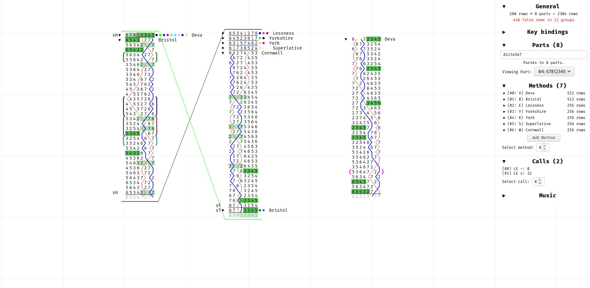

# 3rd Year Project

This repository contains source code & report for my 3rd year project.

## Overview

The goal of this project is to design and build a visual application which will _aid_ composers of
pieces of [Change Ringing](https://en.wikipedia.org/wiki/Change_ringing) in their work, whilst
requiring as little change to their existing workflow as possible.  The main advantages provided
over pen/paper is that this program gives instant and correct feedback on loads of useful
information such as music, length and falseness (and other less important statistics like
'all-the-work-ness' which are still tedious to calculate manually).  This is very much still a
W.I.P. prototype, but here's a screenshot:



## Build Instruction

This project is mostly written in Rust, but runs a web GUI using JS (communicating with Rust through
wasm).  Therefore, the project can simply run as a static website with no additional dependencies -
indeed, when it becomes remotely usable I will simply add it to my website for people to use at
their leisure.  If you _do_ want to build it from source, then you will need to
[install Rust](https://www.rust-lang.org/tools/install) and then install the necessary tools with
the following commands:
```bash
rustup target add wasm32-unknown-unknown
cargo install wasm-bindgen-cli
```

To build, run `build.py` (it doesn't matter where in the code you are, running `../build.sh`
from `proj/` will work just fine - at least on Linux).
